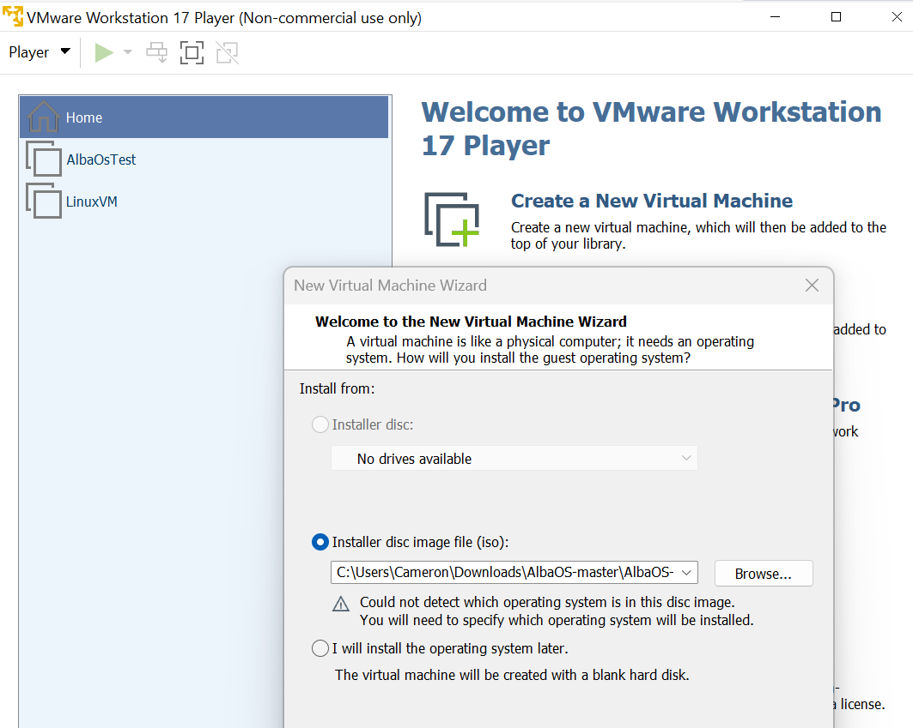

# AlbaOS #
AlbaOS is a 32 bit operating system developed by me from scratch as a hobby <3

[](https://www.gnu.org/licenses/gpl-3.0)


## How To Run AlbaOS On A Virtual Machine

+ Clone the repo localy / Download the zip folder

+ In your virtual machine select the boot / installer disc file as albaos.iso (in this example im using VMware workstation)




+ Run the virtual machine!

## How To Compile AlbaOS On Linux
+ make sure you have the installs listed below
+ cd to root folder (/AlbaOs)
+ use command: " make clean " to remove all generated .o , .bin and ,iso files
+ use command: " make albaos.iso " to generate all needed files


## Installs

```
sudo apt-get install g++
sudo apt-get install binutils
sudo apt-get install libc-dev-i386
sudo apt-get install grub-legacy
sudo apt-get install xorriso

```

+ g++ is a the compiler for the c++ code as i dont want to write my own
+ binutils is a binary manager as well as managing the assembaly code
+ libc-dev-i386 is the 32 bit architecture for the kernel
+ grub legacy allows for multibooting and installing the os into the grub
+ xorriso so the digital disc file (.iso) can be generated

(note) : grub-legacy is unavailable but grub-common or grub2 will work fine

## Stuff i've implemented 
+ working console output (printf) and coloured printf
+ Global Descriptor Table (GDT)
+ Ports
+ Interrupts
+ Keyboard Driver
+ Virtual Keyboard Driver
+ Mouse Drivers
+ PCI (Peripheral Component Interconnect) and BAR (base address registers) 
+ Owl Art (:
+ Random numbers
+ Vga graphics mode
+ Graphics framework
+ Multitasking
+ Speaker audio with PIT
+ The AlbaOS Command Line (ACL)
+ Heap with Malloc Implemtation
+ Amd_am79c ... Network Driver
+ CPU Identification
+ Ata Hard Disk Read / Write and Identification
+ Object File System (OFS)
+ Syscalls
+ GUI
+ Programs (Nests):
+    - File Edit Nest
+    - Snake Game Nest
+ CMOS Driver
+ The AlbaOS Standard Library (ASL)
+ Raycasting Engine (Sorta...)
+ Power Management (APM , ACPI)
+ Networking
+    - Ethernet Frames 
+    - ARP
+ Many Bugs!

## Alt Builds Of AlbaOS :
+ [AlbaOS For Arm (raspberry pi)](https://github.com/CamH04/AlbaOS-For-Arm/tree/master/rpi4)
+ [AlbaOS For Arm (Cortex-A15)](https://github.com/CamH04/AlbaOS-For-Arm/tree/master/CortexA15)
+ [AlbaOS For Mc (tweaked:cc)](https://github.com/CamH04/Alba-OS-MC)
+ [AlbaOS Rusty](https://github.com/CamH04/AlbaOS-Rusty)

## Website:
With Docs And Other Hoopla
[Link](https://albasoftware.netlify.app/albaos)
Articles
[Link](https://albasoftware-articles.netlify.app/)


## Some Ascii art of my owls:
```
(0,0)
/)_)/
 **

(-,-_)
(x-x(v)7

(@,@)
[(_)]
 **

(^,^)
/)_)/
 **

       <3
  (^,^)  (^,^)
  /)_)/  /)_)/
---**-----**----
```
