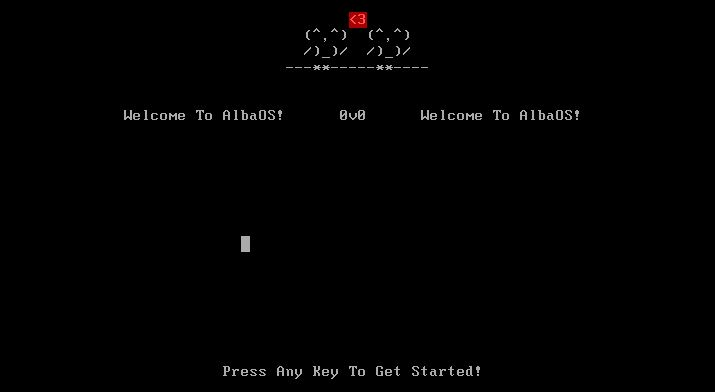

# AlbaOS

**A 32-bit operating system built from scratch as a passion project.**

AlbaOS is a fully functional operating system developed from scratch, featuring a CLI, GUI, multitasking, networking, and a suite of built-in applications. This is a hobby project showcasing kernel development, system-level programming, and OS design patterns.

[](https://www.gnu.org/licenses/gpl-3.0)


---

## Start

### Installation & Setup

1. **Clone the repository:**
   ```bash
   git clone https://github.com/CamH04/AlbaOS.git
   cd AlbaOS
   ```

2. **Install required dependencies:**
   ```bash
   sudo apt-get install g++
   sudo apt-get install binutils
   sudo apt-get install libc-dev-i386
   sudo apt-get install grub-legacy
   sudo apt-get install xorriso
   ```
   
   *Note: If `grub-legacy` is unavailable, `grub-common` or `grub2` will work as alternatives.*

3. **Build the operating system:**
   ```bash
   make clean        # Remove previously generated files
   make albaos.iso   # Generate the bootable ISO image
   ```
   to run in QEMU
   ```bash
   make run  
   ```
   or to run in VirtualBox
   ```bash
   make vrun  
   ```
5. **Run in a virtual machine:**
   - Create a new virtual machine in VMware Workstation, VirtualBox, or similar
   - Mount the `albaos.iso` file as the boot disk
   - Start the virtual machine and enjoy!

### Compile Dependencies
- **g++**: C++ compiler for the kernel codebase
- **binutils**: Binary utilities and assembly code management
- **libc-dev-i386**: 32-bit architecture libraries for kernel compatibility
- **grub-legacy**: Bootloader for multibooting and OS installation
- **xorriso**: ISO 9660 disc image creation and manipulation

---

## Features

### Core Kernel Components
- **Console Output**: printf functionality with colored text support
- **Global Descriptor Table (GDT)**: Memory segmentation and protection
- **Port I/O**: Hardware communication and control
- **Interrupts**: Interrupt handling and exception management
- **Keyboard Driver**: Hardware keyboard input with virtual keyboard support
- **Mouse Drivers**: Pointer device support
- **PCI & BAR**: Peripheral Component Interconnect device detection and Base Address Register management
- **CPU Identification**: CPU feature detection and reporting

### Memory & Storage
- **Heap & Malloc**: Dynamic memory allocation
- **ATA Hard Disk Support**: Read/write operations with disk identification
- **Object File System (OFS)**: Custom filesystem implementation
- **CMOS Driver**: CMOS memory and real-time clock access

### Graphics & Multimedia
- **VGA Graphics Mode**: 32-bit color graphics support
- **Graphics Framework**: Drawing primitives and rendering
- **Raycasting Engine**: 3D graphics rendering capability
- **Speaker Audio with PIT**: Sound generation via the Programmable Interval Timer (PIT)

### Multitasking & System
- **Multitasking**: Process management and scheduling
- **Syscalls**: System call interface for user programs
- **Random Number Generation**: Pseudo-random number support
- **Power Management**: APM and ACPI power management

### Networking
- **Ethernet Frames**: Layer 2 networking support
- **ARP Protocol**: Address Resolution Protocol (ARP) 
- **AMD AM79C Network Driver**: Ethernet driver 

### User Interface
- **AlbaOS Command Line (ACL)**: Custom command-line shell
- **GUI**: Graphical user interface framework
- **AlbaOS Standard Library (ASL)**: Standard library for application development

### Built-in Applications (Nests)
- **File Edit Nest**: Text editor for file edits
- **Snake Game Nest**: Snake game 
- **Metaballs**: Lavalamp style screensaver

### Easter Eggs
- **Owl Art**: Custom ASCII owl artwork <3

---

## Documentation & Resources

For documentation and guides, visit:

- **Documentation**: [AlbaOS Docs](https://albasoftware.netlify.app/albaos)
- **Technical Articles**: [AlbaOS Articles](https://albasoftware-articles.netlify.app/)

---
## Alternative Builds Of AlbaOS :
+ [AlbaOS For Arm (raspberry pi)](https://github.com/CamH04/AlbaOS-For-Arm/tree/master/rpi4)
+ [AlbaOS For Arm (Cortex-A15)](https://github.com/CamH04/AlbaOS-For-Arm/tree/master/CortexA15)
+ [AlbaOS For Mc (tweaked:cc)](https://github.com/CamH04/Alba-OS-MC)
+ [AlbaOS Rusty](https://github.com/CamH04/AlbaOS-Rusty)
---

```
    (0,0)
    /)_)/
     **

   (-,-_)
    (x-x(v)7

    (@,@)
    [(_)]
     **

    (^,^)
    /)_)/
     **

        <3
   (^,^)  (^,^)
   /)_)/  /)_)/
 ---**-----**----
```
---
